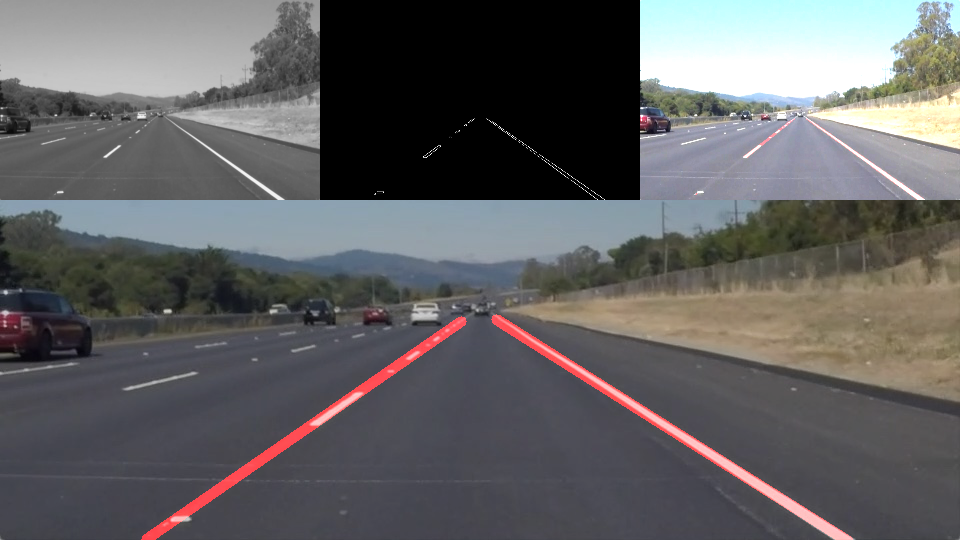

# **Finding Lane Lines on the Road**
[](http://www.udacity.com/drive)



When we drive, we use our eyes to decide where to go.  The lines on the road that show us where the lanes are act as our constant reference for where to steer the vehicle.  Naturally, one of the first things we would like to do in developing a self-driving car is to automatically detect lane lines using an algorithm.

[//]: # (Image References)

[edges_image]: ./test_images_output/edges.jpg
[roi_image]: ./test_images_output/roi_img.jpg
[masked_edges]: ./test_images_output/masked_edges.jpg
[line_img]: ./test_images_output/line_img.jpg
[final_image]: ./test_images_output/test_img.jpg

Overview of the pipeline
---

* Read in and grayscale the image
* Define a kernel size and apply Gaussian smoothing
* Define Canny thresholds and apply canny transform to get the edges image
* Define a four sided polygon to create a masked edges image using cv2.fillpoly()
* Define the Hough transform parameters,Run Hough Transform to find lines in the image
* Separate lines into left and right lines, draw a single line on the left and right lanes
* Find the best fit line for the left and right line points
* Extrapolate the lines in order to get one single line that cover the entire lane line

Pre-processing the image
---

The first two steps does some pre-processing to the image that will make our life easier in the next steps. 
First, convert the image color space from RGB to GRAY,in OpenCV converting color space is as simple as calling a function:

```
img = cv2.cvtColor(img, cv2.COLOR_RGB2GRAY)
```

Then, applying the Gaussian filter is to remove noise and avoid noisy edges to be detected.

Finding the edges
---

 Canny edge detection algorithm uses the gradient of the image with a low and high threshold parameters to find edges. If you're interest in learning more about Canny Edge check out this [link](http://aishack.in/tutorials/canny-edge-detector/). I used 50 and 150 for the low and high threshold respectively.
![alt text][edges_image]
The canny edge algorithm returns a binary image with white pixels belonging to the edges the algorithm detected. There are still some unwanted edges found in the image, but since the camera is always in a fixed position we can simply define a region of interest and discard everything outside this region. with a region of interest I got only pixels belonging to the lane markings! The next steps is to find actual line points from this image.
![alt text][roi_image]
![alt text][masked_edges]

Hough Transform and extrapolating lines
---

This is probably the most complicated step. 
**Step 1**, apply the [Hough Transform](https://docs.opencv.org/2.4/doc/tutorials/imgproc/imgtrans/hough_lines/hough_lines.html) Algorithm. Basically, it receives the output of any edge detection algorithms such as canny edges and tries to find lines. The algorithm is a bit complex but the way it works is beautiful! Check out this [article](https://alyssaq.github.io/2014/understanding-hough-transform/) if you're interest in learning how to implement it. For applying the Hough Transform I decided to use following parameters:

*   Rho: 2
*   Theta: PI/180
*   Threshold: 30
*   Min Line Length: 10
*   Max Line Gap: 30

Initially I was using lower values for the Max Line Gap, but increasing it to a higher value improved the line detection as it was able to "connect" the dashed white lane markings. Bellow is the output of the raw lines detected plotted onto the original image.
![alt text][line_img]

 As you can see it detects multiples lines for each lane markings. So we need a way to average these lines. The idea is to find two lines, one for the left lane and another for the right lane.

**Step 2**,  separate the lines found into left and right lines. The way we can do that is by computing the slope of the line:

*   If slope is positive (as y decreases, x decreases as well), the line belongs to the right lane.
*   If the slope is negative (as y decrease, x increases), the line belongs to the left lane.

**Step 3**, use line the points to find a best fit line using the least square method. In python it's possible to easily calculate that by using [np.polyfit()](https://docs.scipy.org/doc/numpy-1.13.0/reference/generated/numpy.polyfit.html). This function will return the coeficientes of the line equation (y = mx + b). With this equation I can easily plot a line from the bottom of region of interest to the top of it. The image below shows the final output of the pipeline, previous steps are also shown for better understanding.
![alt text][final_image]

Areas to improve
----------------

*   Straight Lines aren't able to detect lane lines properly in curves. 
*   One potential solution is to use quadratic functions to fit the lane markings.
